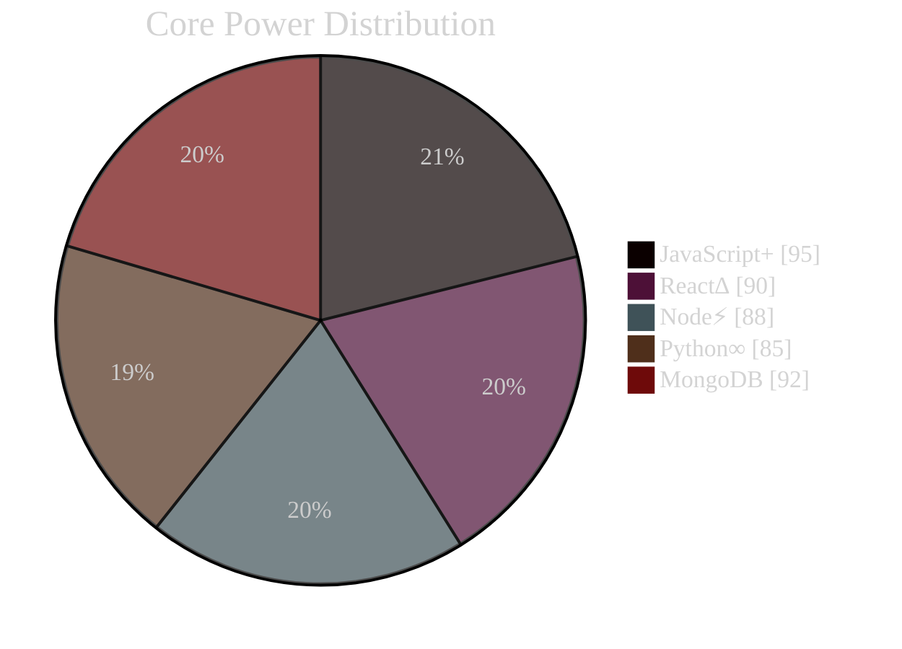

<div align="center">
  
</div>

<!-- BOOT SEQUENCE -->
<div align="center">

```diff
+ NEURAL INTERFACE INITIALIZATION...
- QUANTUM CORE: MAXIMUM POWER
! SYNAPTIC PROCESSORS: OVERCLOCKED
@@ CONSCIOUSNESS UPLOAD: COMPLETE @@
# SYSTEM STATUS: TRANSCENDED
```

[](https://git.io/typing-svg)

</div>

<!-- DIGITAL IDENTITY MATRIX -->
```python
class QuantumDeveloper:
    def __init__(self):
        self.identity = {
            "name": "TAHSIN FAIYAZ",
            "alias": "SAYOR",
            "role": "QUANTUM_ARCHITECT",
            "location": "QUANTUM_REALM",
            "status": "OMNIPRESENT",
            "power_level": "UNLIMITED"
        }
        self.arsenal = {
            "quantum_languages": ["JavaScript+", "Python∞", "TypeScriptΩ"],
            "neural_frameworks": ["React∆", "Node⚡", "Next☢"],
            "consciousness_level": "TRANSCENDED",
            "power_status": "MAXIMUM_OVERDRIVE"
        }

    async def execute_neural_handshake():
        return "CONNECTION ESTABLISHED... WELCOME TO THE DIGITAL EMPIRE"
```

<!-- HOLOGRAPHIC STATS DISPLAY -->
<div align="center">
  
  
</div>

<!-- QUANTUM ARSENAL -->
<div align="center">
<h2>⚡ TECHNOLOGICAL SUPREMACY ⚡</h2>


<!-- POWER METRICS -->
<table align="center">
<tr>
<td width="50%">

<h3 align="center">POWER LEVELS</h3>



</td>
<td width="50%">

<div align="center">
<h3>NEURAL NETWORK STATUS</h3>

</div>

</td>
</tr>
</table>
</div>

<!-- NEURAL ACTIVITY -->
<div align="center">
  <h2>🧬 QUANTUM SYNAPTIC ACTIVITY 🧬</h2>
  
</div>

<!-- DIGITAL ARTIFACTS -->
<div align="center">
  <h2>🔮 QUANTUM PROJECTS 🔮</h2>
  

  <!-- FEATURED REPOSITORIES -->
  <div style="display:grid; grid-template-columns: repeat(2, 1fr); gap: 10px;">
    <a href="https://github.com/Sayor00/project1">
      
    </a>
    <a href="https://github.com/Sayor00/project2">
      
    </a>
  </div>
</div>

<!-- QUANTUM CHANNELS -->
<div align="center">
  <h2>🌐 NEURAL LINKS 🌐</h2>
  
  [](mailto:tahsinfaiyazsayor00@gmail.com)
  [](https://linkedin.com/in/your-profile)
  [](https://your-portfolio.com)
  
  <!-- VISITOR COUNTER -->
  <h3>ENTITIES DETECTED IN THE MATRIX</h3>
  
</div>

<!-- SPOTIFY INTEGRATION -->
<div align="center">
  <h2>🎵 NEURAL FREQUENCIES 🎵</h2>
  
</div>

<!-- QUANTUM SNAKE -->
<div align="center">
  <h2>🐍 CONTRIBUTION MATRIX 🐍</h2>
  <picture>
    <source media="(prefers-color-scheme: dark)" srcset="https://raw.githubusercontent.com/platane/platane/output/github-contribution-grid-snake-dark.svg">
    <source media="(prefers-color-scheme: light)" srcset="https://raw.githubusercontent.com/platane/platane/output/github-contribution-grid-snake.svg">
    
  </picture>
</div>

<!-- SYSTEM TERMINATION -->
<div align="center">
  
  
  
</div>
